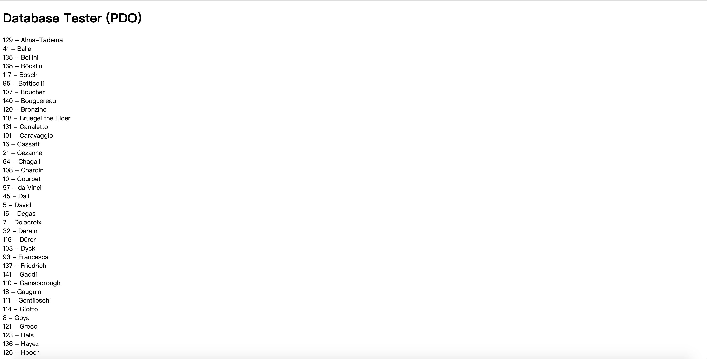
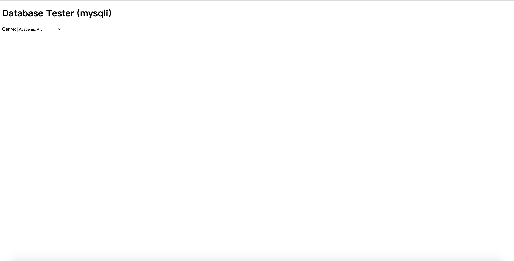
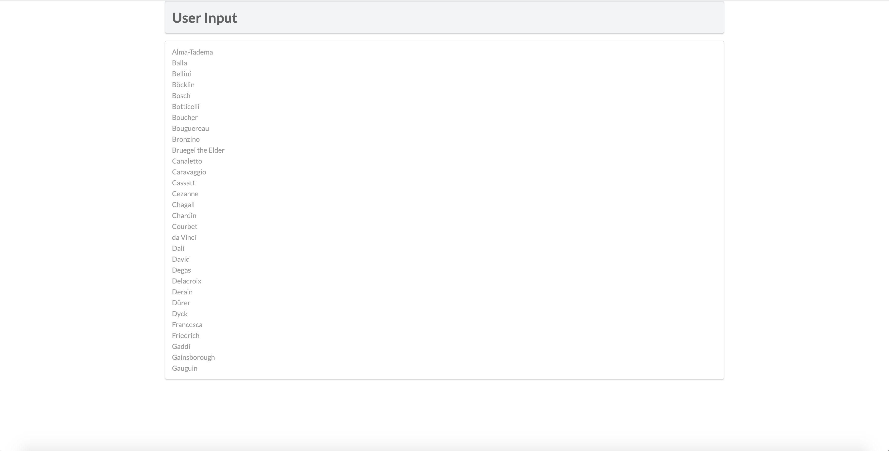
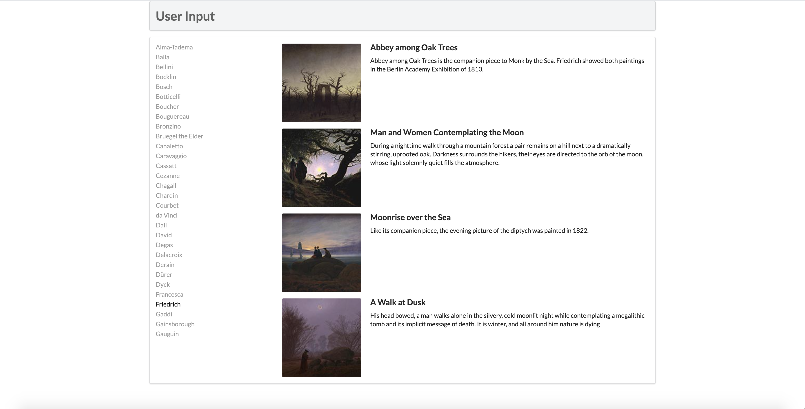

# lab10设计文档

### exercise7

截图如下：

#### PDO方法

PDO::ATTR_ERRMODE是持续性连接

PDO::ERRMODE_EXCEPTION指产生致命错误，如果发生错误，则抛出一个 PDOException 异常。

 $sql = "select * from Artists order by LastName";是指在数据库中根据姓氏排列从Artists表中选出所有内容。
 
 $result = $pdo->query($sql);指搜索结果
 
 while ($row = $result->fetch()) {
         echo $row['ArtistID'] . " - " . $row['LastName'] . " ";
 }是指循环打印
 
#### mysqli方法

mysqli_connect(DBHOST, DBUSER, DBPASS, DBNAME)连接数据库

if语句判断是否连接成功

后面与PDO方法差不多

 mysqli_free_result($result);释放result占用的空间
 
 mysqli_close($connection);关闭与数据库的连接

### exercise8

截图如下：

#### outputArtists
1.通过PDO连接数据库

2.根据姓氏从第一行开始选出30个artists

3.通过a链接传递艺术家的id，同时判断a的class是active还是item

4.通过$_GET['id']判断是否被点中，从而赋予不同的class，以此改变样式

5.这个function主要用来输出artists

#### outputPainting

1.通过$_GET['id']判断被选中的artist，从数据库读取他的照片（select sql语句）

2.根据获得的结果循环展示选中的artist的照片

3.try-catch语句判断是否产生错误

#### outputSinglePainting

1.通过参数$row['ImageFileName']、$row['Title']、$row['Excerpt']确定当前艺术家的作品的主要信息并按照相同的样式打印出来

2.全部输出html语句来打印单张图片及信息，用于上一个function中

### exercise9

截图同exercise8

#### 执行sql语句的方式

1.PDOStatement::bindValue — 把一个值绑定到一个参数

2.PDOStatement::execute — 执行一条预处理语句

3.Connection：代表数据库连接对象

4.Statement ：用于执行SQL语句的对象；

1): 通过Connection 的createStatement（）方法获取；

2): 通过executeUpdate(sql) 可以执行SQL语句；

3): 通过传入的sql 可以是insert、update或者delete ；但不能使select；

5.connection 和 Statement 都是服务器和应用程序的连接资源，需要及时关闭；需要在finally 中最终关闭.

6.关闭的顺序，先关闭后获取的，即先关闭Statement ，后关闭connection

用prepared statements减少了代码量，预编译SQL语句，性能更好，执行更快，使编程更简单，安全性更好。

