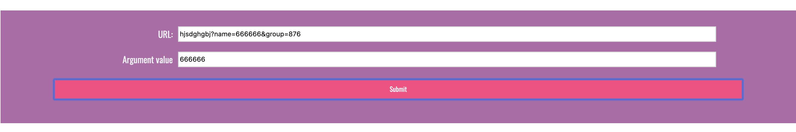
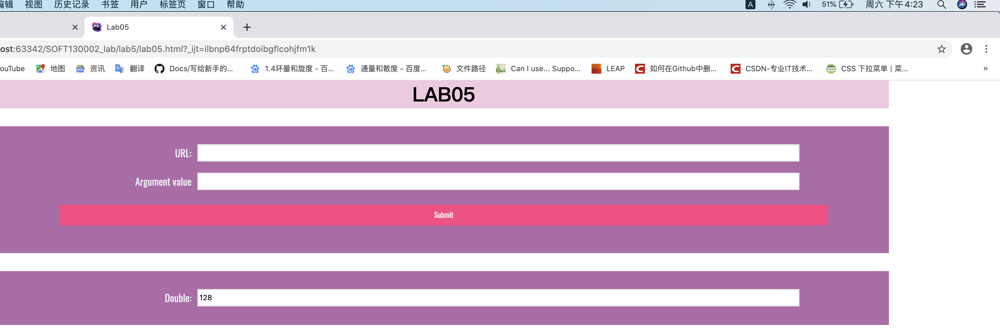
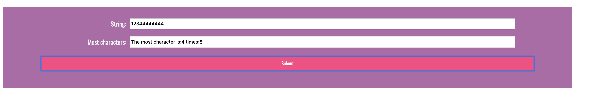
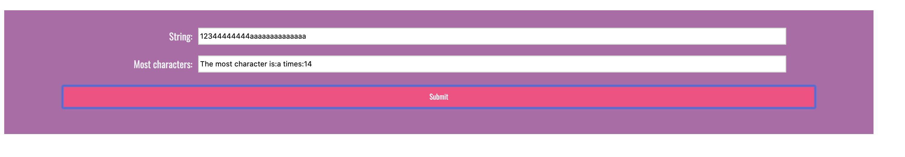

# lab5设计文档

## 1.提取url中name的参数

先找到url中"name="所在位置，命名为a，然后再分情况讨论：

（1）name后面还有别的参数，当中用&连接

（2）name后面没有别的参数

所以再继续找后面还有没有&，如果有，那么name的参数为"="后面到"&"之间的部分；如果没有，那么就截取"="后面的所有内容即为name的参数

效果图如下：

## 2.五秒运行一次函数，直到整分钟或者50秒钟为止

主要运用的是window.setInterval 和 window.clearInterval，

a为开始时的分钟数，b为开始时的秒数

如果离下一分钟的时间超过50s，那么50s之后就停止运行interval = window.setInterval(...(window.clearInterval(Interval)),5000)

如果离下一分钟的时间不超过50s，分情况讨论：

（1）如果a为59，那么所在分钟数为0时，就停止运行 window.clearInterval()

（2）如果a不为59， 那么所在分钟数>a时，即停止运行 window.clearInterval()

例如下图，开始时为下午四点22分23秒，结束时间为四点23分，运行了37秒，共七次，2^7=128

## 3.找出字符串中出现次数最多的字符

创建const obj = {},遍历字符串，某字符第一次出现赋值为一，不是第一次出现就把次数++，然后比较obj里面字符出现次数，最多的字符赋值给max，次数赋值给max_value

效果图如下：

