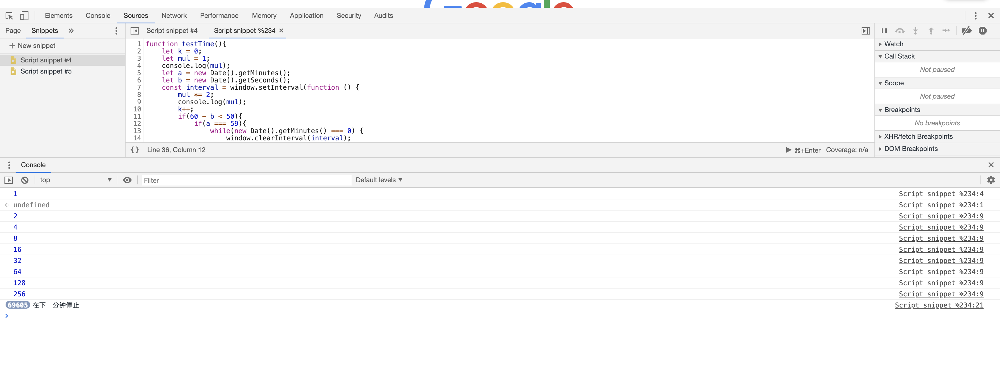
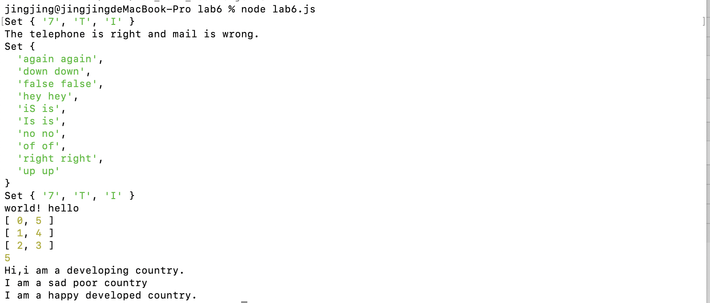

# lab6设计文档

## 1.各个正则表达式的解释
### ①手机号码校验/^1[3456789]\d{9}$/

--> ^表示正则表达式的开始符号

--> 必须以1开头

--> 第二位必须是3456789中的一个数

--> 后面只能跟9位数字

--> $表示正则表达式的结束符号

### ②邮箱校验/^([a-zA-Z0-9._-])+@([a-zA-Z0-9_-])+(\.[a-zA-Z0-9_-])+/

--> ^表示正则表达式的开始符号

--> [a-zA-Z0-9._-]表示允许出现大小写字母、0-9数字、._-这些符号，次数位置不限，但至少有一个

--> 然后必须出现一个@

--> [a-zA-Z0-9_-])+(\.[a-zA-Z0-9_-]表示允许出现大于一个字母数字或_-，后面跟上一个.,再跟上字母数字或者_-

--> $表示正则表达式的结束符号

--> 可以用test来匹配

### ③第三题的正则表达式我用的是search

if(array[i].toUpperCase().search(array[i+1].toUpperCase())===0)

这个式子表示如果前一项变成大写后与后一项变成大写后如果相同，就执行后面的语句

search() 方法用于检索字符串中指定的子字符串，或检索与正则表达式相匹配的子字符串。

stringObject.search(regexp)

返回stringObject 中第一个与 regexp 相匹配的子串的起始位置。

如果没有找到任何匹配的子串，则返回 -1。

## 2.继承不同方式的理解
### ①构造函数式继承
    function SubType(){
    
        //继承了SuperType
        
        SubType.call(this);
        
    }

优势在于子类型可以向超类型构造函数传递参数

劣势在于方法都在构造函数中定义，难以复用函数

### ②原型链继承

    SubType.prototype = new SuperType();

不使用SubType默认提供的原型，而是换了一个新原型，这个新原型是SuperType的实例

原型链的问题在于在通过原型来继承时，原型变成了另一个类型的实例，于是原先的实例属性就变成了现在的原型属性。SubType的所有实例都会共享这个属性，修改一个实例的该属性，所有实例都会修改

第二个问题在于在创建子类型的实例时，不能向超类型的构造函数中传递参数。

### ③Object.create

    var subTypeInstance = Object.create(new superType())
    
    var subTypeInstance = Object.create(superType,{
        //定义属性
    })

以这种方式指定的任何属性都会覆盖原型对象上的同名属性

## 3.Map、Set、Array之间的区别和使用
### （1）Map

Array.map()用法

map() 方法返回一个新数组，数组中的元素为原始数组元素调用函数处理后的值。

map() 方法按照原始数组元素顺序依次处理元素。

    map() 不会对空数组进行检测。
    
    map() 不会改变原始数组。
    

### （2）Set

    Set存储不重复的key
    

Set与Array和map类似，只是存储不重复的值

### （3）Array
创建array对象

    new Array();
    new Array(size);
    new Array(element0, element1, ..., elementn);
    

concat() :连接两个或更多的数组，并返回结果。

join() :把数组的所有元素放入一个字符串。元素通过指定的分隔符进行分隔.

reverse(): 颠倒数组中元素的顺序。

sort() :对数组的元素进行排序.

splice() ;对数组的元素进行排序.

toLocaleString() :把数组转换为本地数组，并返回结果。

## 4.GitHub截图

## 5.本地命令行截图
第一题截图

