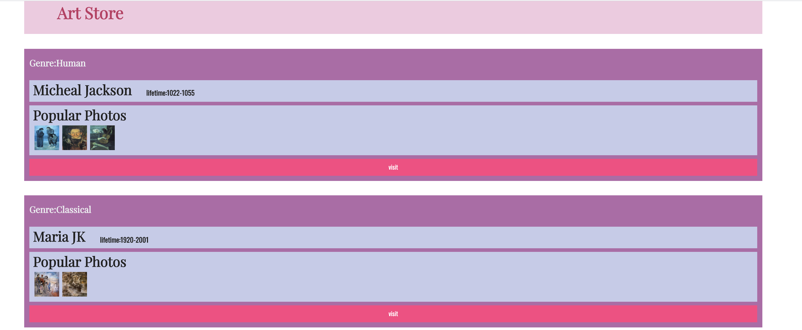
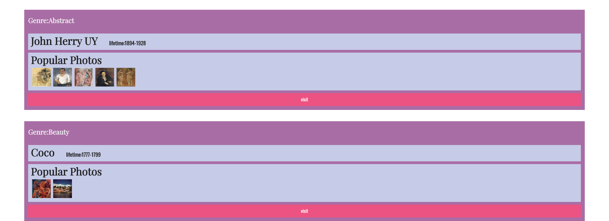

# lab7设计文档

#### 遇到的困难
1.不知如何使用DOM通过js写入html

2.四个方框不知如何并在一起一次性写入

#### 解决方法
1.DOM

（1）document.createElement(); 创造一个元素

（2）element.setAttribute();  设置属性

（3）.append（）把括号内的添加上去

2.通过for循环使用给定的works，一次性写入html网页中

#### 效果图

